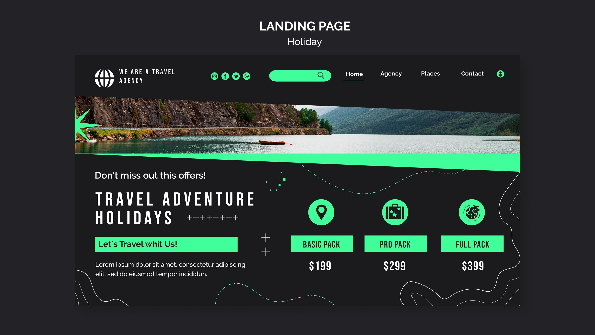

# Pixel-perfect верстка макета
[ссылка на страницу](https://chrt.ddns.net/verstka/7)

`Shift`+`H` для переключения видимости макета

## Фичи 
 - [Макет](materials/layout.png)([.psd](materials/layout.psd)), в котором не выравнено примерно ничего
 - Требование "±10px"
 - Адаптация без макета для разных устройств
 - Искренние попытки в БЭМ (хоть в нем и можно задавать положение только блокам)
